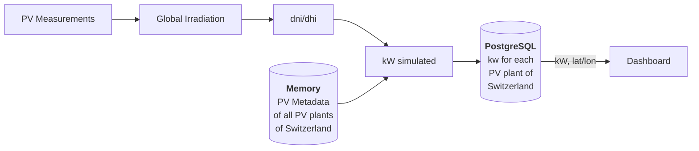

# pv_mapping_ch
Map the total pv power produced in Switzerland in real-time

# Architecture

```mermaid
flowchart LR
  Y -->|kW, lat/lon| Z[Dashboard]

  W[PV Measurements<br>] --> V[Global Irradiation]

  V --> U[dni/dhi]
  U --> Q[kW simulated]

  X[(<b>Memory</b><br>PV Metadata<br>of all PV plants<br>of Switzerland)] --> Q
  Y[(<b>PostgreSQL</b><br>kw for each<br>PV plant of<br>Switzerland)]

  Q --> Y

```
