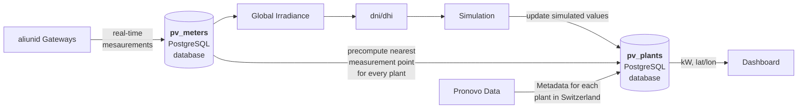

# pv_mapping_ch
Map the total pv power produced in Switzerland in real-time

# File Overview
```
.
├── PvMapping
│   ├── db.py                               # Database access layer
│   ├── frontend.py                         # Entrypoint for launching dashboard using plotly
│   ├── ingest.py                           # Entrypoint for ingest pipeline
│   ├── irradiance.py                       # Estimation of irradiance from power, as well as irradiance conversions
│   ├── models.py                           # Data model definitions
│   ├── output.py                           # Prediction of output power from irradiance data.
│   └── source
│       ├── __init__.py                     # Abstract base class of SourceThread
│       ├── offline.py                      # OfflineSourceThread, dummy data source for demo purposes
│       └── online.py                       # OnlineSourceThread, not implemented yet.
├── README.md
├── requirements.txt
├── scripts                                       # Utility scripts
│   ├── load_db.py                          # Create database tables from pickle files
│   └── update_nearest_neighbor.py          # Recompute distance matrix and store nearest neighbors in database.
├── test
│   ├── __init__.py
│   └── test_db.py

```

# Architecture




